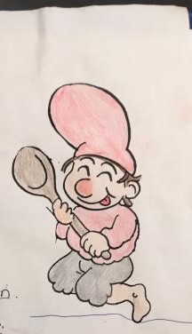
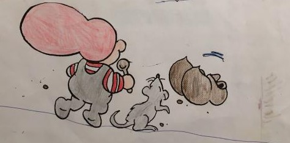

# Havregrynskugler                                   {#HGKPage}

Inger-Lise havregrynskugler

## Indhold:
- 250 g smør
- 7,5 dl havregryn
- 2,5 dl kokosmel
- 4 dl flormelis
- 2,5 ts vaniliesukker
- 5 ss kakao
- 3 ss vand

Derudover skal der bruges kokosmel til at trille kuglerne i.

## Fremgangsmåde:
1. Det hele æltes sammen.
2. Trilles i kokosmel.

